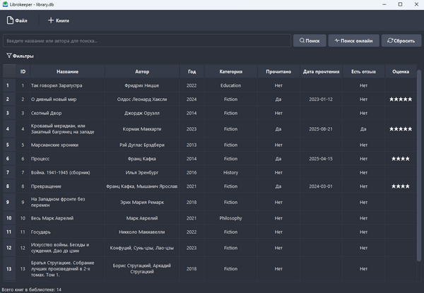
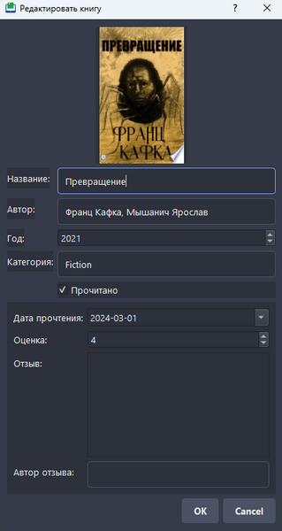
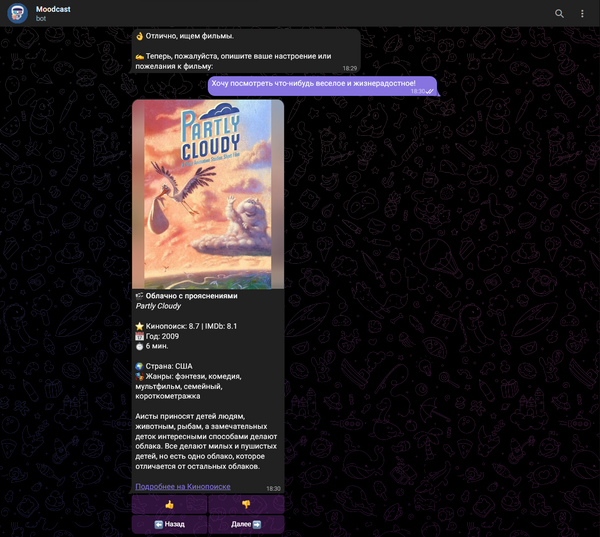
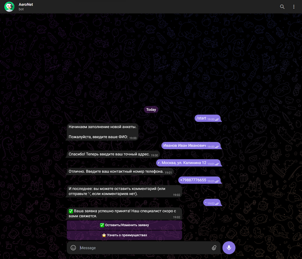
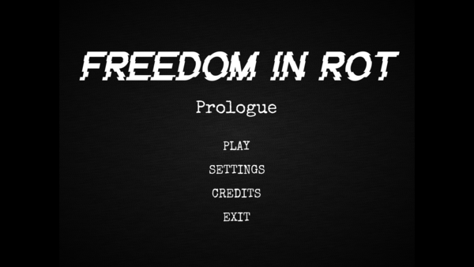
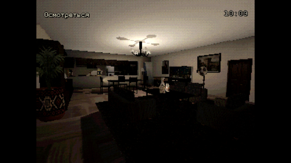

# Technical Portfolio

A compact overview of my personal projects in Python, Telegram bots, desktop applications and Godot prototypes.

I focus on building small complete products: application logic, user interface, API integration, data storage, testing and publication.

---

## Tech Stack

**Python:** PyQt, SQLite, Telegram Bot API, REST API, JSON, Google APIs, Hugging Face  
**Game Development:** Godot 4, GDScript, 3D scenes, UI, localization, prototyping  
**Tools:** Git, GitHub, technical documentation, debugging, basic testing

---

## Projects

| Project | Stack | Description |
|---|---|---|
| **Librokeeper** | Python, PyQt, SQLite, Google Books API | Desktop application for managing a home library: local database, book editing, search and Google Books integration. |
| **Moodcast** | Python, Telegram Bot API, Hugging Face, REST API, JSON | Telegram bot that recommends movies and TV shows based on the user's mood. |
| **AeroNet** | Python, Telegram Bot API, Google Sheets API | Telegram bot for collecting customer applications and saving them to Google Sheets. |
| **Freedom in Rot: Prologue** | Godot 4, GDScript, UI, localization | Short first-person psychological horror prototype published on itch.io. |
| **Incident 21:37** | Godot 4, GDScript, 3D, UI | Work-in-progress PSX-style horror project with task system, in-game time and interactive objects. |

---

## Project Details

### Librokeeper

Desktop application for managing a personal home library.

Main features:

- local SQLite database;
- adding, editing and deleting books;
- search by title and author;
- book information lookup through Google Books API;
- desktop UI built with PyQt.

---

### Moodcast

Telegram bot for movie and TV show recommendations based on the user's mood.

Main features:

- mood analysis from text messages;
- movie and TV show recommendations;
- integration with an NLP model from Hugging Face;
- external API usage for content data;
- Telegram interface with inline buttons.

---

### AeroNet

Telegram bot for collecting customer applications.

Main features:

- step-by-step application form;
- validation and correction of user input;
- saving collected data to Google Sheets;
- Telegram interface with buttons;
- simple business process automation.

---

### Freedom in Rot: Prologue

Short first-person psychological horror prototype made in Godot.

The project includes:

- first-person interaction;
- atmospheric scene setup;
- UI and main menu;
- several endings;
- Russian and English localization;
- publication on itch.io.

Available on itch.io:  
https://d-ehrenburg.itch.io/freedom-in-rot

---

### Incident 21:37

Work-in-progress PSX-style horror project made in Godot.

The current prototype includes:

- apartment and street scenes;
- task system;
- in-game time;
- interactive objects;
- visual style switching;
- first-person exploration.

---

## Notes

Some screenshots show Russian-language interfaces because the projects were primarily designed for Russian-speaking users.

Some game prototypes use third-party assets, music and sound effects. Third-party materials used in **Freedom in Rot: Prologue** are credited inside the game.

For **Incident 21:37**, third-party PSX-style asset packs are used as a base for some environments. Scene setup, interaction logic, UI, task system, visual style integration and project implementation are done in Godot.

Asset packs used in Incident 21:37:

- House Interior | PSX Asset Pack — McPato  
  https://mcpato.itch.io/house-interior-psx-assets

- PSX Style Urban Stacked Pack — valsekamerplant  
  https://valsekamerplant.itch.io/psx-style-urban-stacked-pack

---

## Links

- GitHub profile: https://github.com/DamianEhrenburg
- Personal website: https://damianehrenburg.neocities.org
- Freedom in Rot: Prologue: https://d-ehrenburg.itch.io/freedom-in-rot
