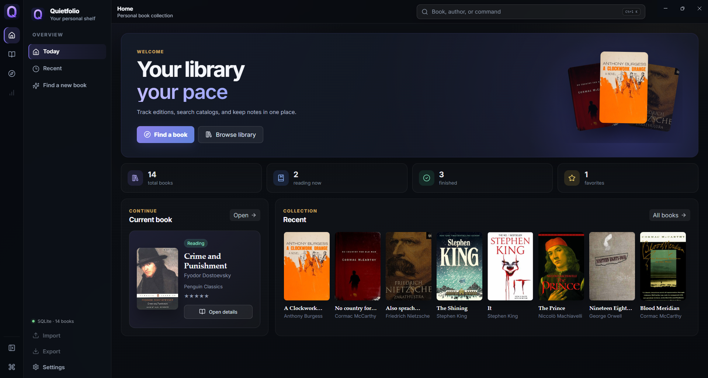
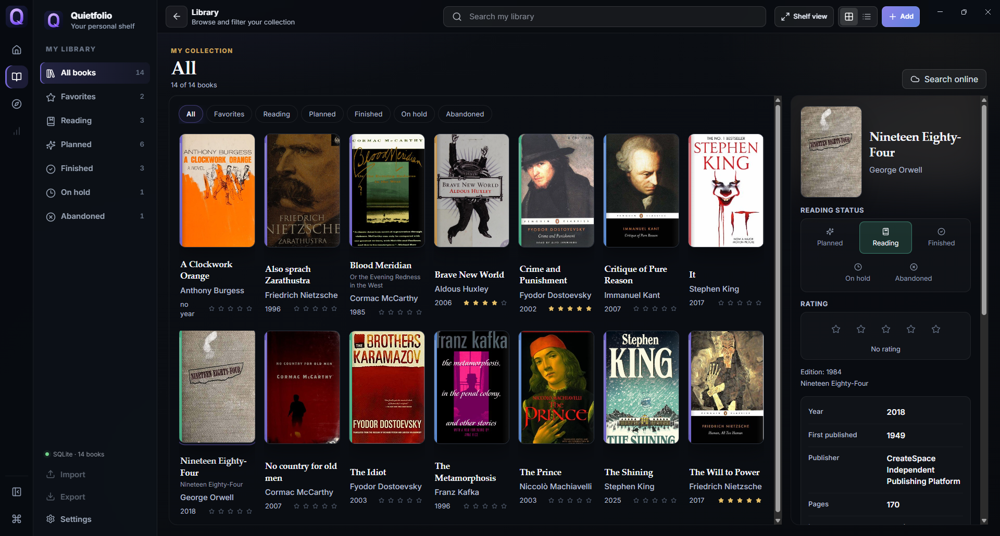
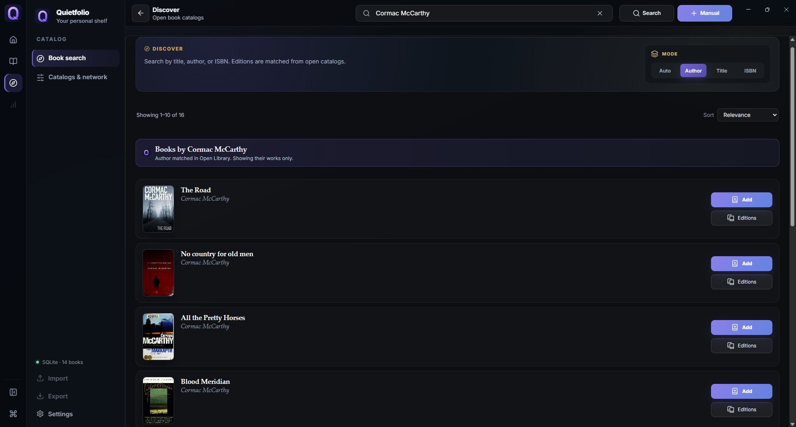
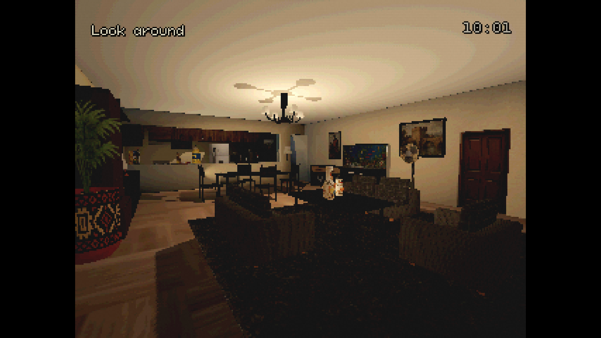
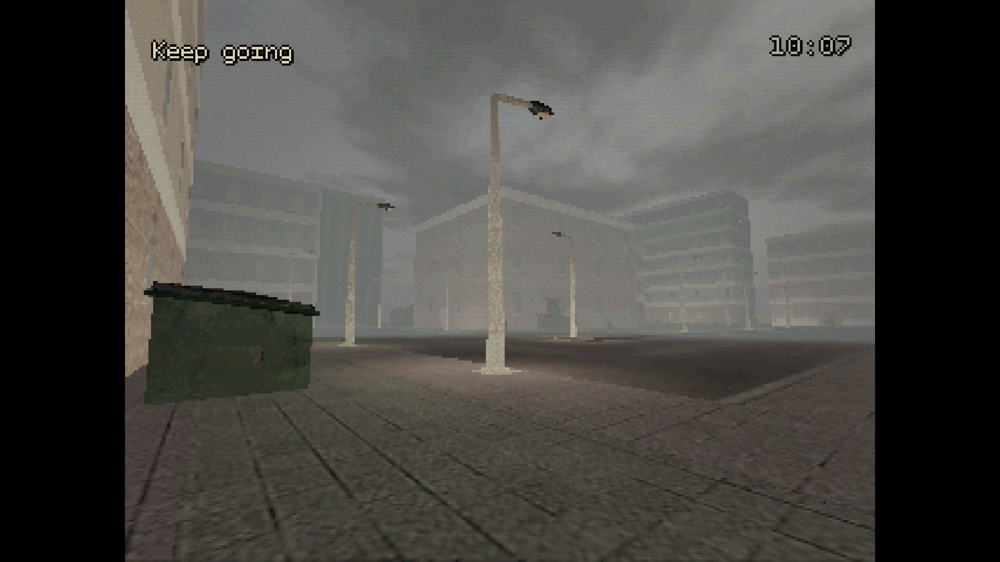
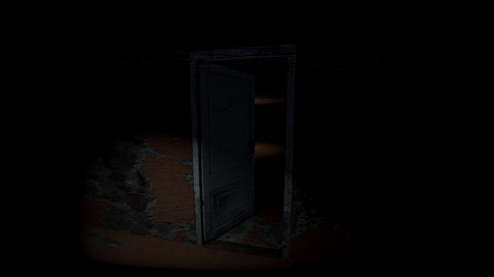

# Technical Portfolio

I work on small practical projects: desktop tools, Telegram bots, API integrations and Godot prototypes.

This repository collects projects I can show with screenshots and short notes.

---

## Projects

| Project | Type | Stack |
|---|---|---|
| Quietfolio | Desktop app | TypeScript, React, Electron, SQLite |
| Moodcast | Telegram bot | Python, Telegram Bot API, Hugging Face, REST API |
| AeroNet | Telegram bot | Python, Telegram Bot API, Google Sheets API, REST API |
| Incident 21:37 | Game prototype | Godot 4, GDScript, 3D |
| Freedom in Rot: Prologue | Published game prototype | Godot 4, GDScript, 3D |

---

## Quietfolio

Desktop app for managing a personal book library: books, covers, notes, reading statuses and online catalog search.

The app uses local SQLite storage and a dark interface focused on browsing, editing and finding book editions.

  

  
  

Repository: https://github.com/DamianEhrenburg/quietfolio

---

## Moodcast

Telegram bot that recommends movies and TV shows from a mood description.

The bot uses a conversational flow, external movie data and an NLP model from Hugging Face.

  

---

## AeroNet

Telegram bot for collecting customer applications and saving them to Google Sheets.

The bot guides the user through a form, validates input and saves the collected data to Google Sheets through an external API.

  

---

## Incident 21:37

Work-in-progress PSX-style horror prototype made in Godot.

The current build includes apartment and street scenes, interactable objects, task text, in-game time and a low-resolution visual style.

  
  

---

## Freedom in Rot: Prologue

Short first-person horror prototype published on itch.io.

The project includes first-person interaction, several endings, UI, settings, credits and Russian/English localization.

  
  

Itch.io: https://d-ehrenburg.itch.io/freedom-in-rot

---

## Notes

Some screenshots show Russian-language interfaces because the projects were originally designed for Russian-speaking users.

Some game screenshots include third-party assets. In Incident 21:37, the apartment scene uses House Interior | PSX Asset Pack by McPato, and the street scene uses PSX Style Urban Stacked Pack by valsekamerplant. Scene setup, interaction logic, UI, game flow, lighting and Godot implementation are my work.

For Freedom in Rot: Prologue, third-party assets, music and sound effects are credited inside the game.

---

## Links

- GitHub profile: https://github.com/DamianEhrenburg
- Personal website: https://damianehrenburg.neocities.org
- Freedom in Rot: Prologue: https://d-ehrenburg.itch.io/freedom-in-rot
